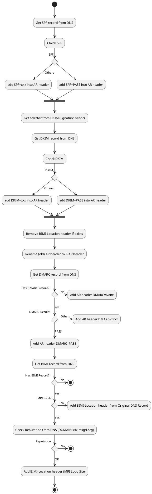
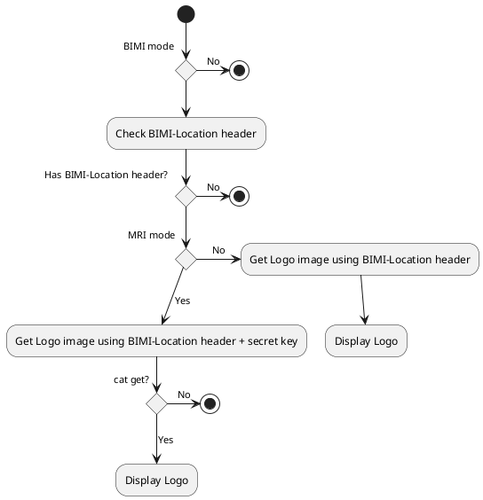

# MTAでの流れ

```plantuml
@startuml

(*) --> "Get SPF record from DNS" as spf
--> "Check SPF"
--> if "SPF"
    --> [Others] "add SPF=xxx into AR header"
    --> ==join_DKIM==
else
    --> "add SPF=PASS into AR header"
    --> ==join_DKIM==

==join_DKIM== --> "Get selector from DKIM-Signature header" as DKIM
--> "Get DKIM record from DNS"
--> "Check DKIM"
--> if "DKIM"
    --> [Others] "add DKIM=xxx into AR header"
    --> ==join_DMARC==
else
    --> "add DKIM=PASS into AR header"
    --> ==join_DMARC==


==join_DMARC== --> "Remove BIMI-Location header if exists"
--> "Rename (old) AR header to X-AR header"

--> "Get DMARC record from DNS"
--> if "Has DMARC Record?"
    -right-> [No] "Add AR header DMARC=None"
else
    --> [Yes] if "DMARC Result?"
        -right-> [Others] "Add AR header DMARC=xxxx"
    else
        --> [PASS] "Add AR header DMARC=PASS"

--> "Get BIMI record from DNS"
--> if "Has BIMI Record?"
    -right-> [No] (*1)
else
    --> [Yes] if "MRI mode"
        -right-> [No] "Add BIMI-Location header from Original DNS Record"
    else
        --> [YES] "Check Reputation from DNS (DOMAIN.xxx.msgri.org)"

--> if "Reputation"
    -right-> [NG] (*2)
else
    --> [OK] "Add BIMI-Location header (MRI Logo Site)"
    --> (*3)

@enduml
```

# MUAでの流れ

```plantuml
@startuml
(*) --> if "BIMI mode"
    -> [No] (*1)
else
--> "Check BIMI-Location header"
--> if "Has BIMI-Location header?"
    -> [No] (*2)
else
--> if "MRI mode"
    -right-> [No] "Get Logo image using BIMI-Location header"
    --> "Display Logo"
else
--> [Yes] "Get Logo image using BIMI-Location header + secret key"
--> if "cat get?"
    -> [No] (*3)
else
    --> [Yes] "Display Logo" as display2


@enduml
```